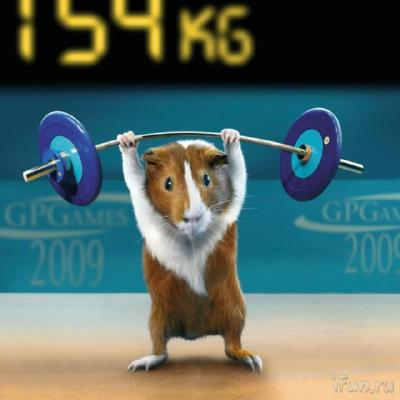

# Why Cuis?
*By Ken Dickey*

Greetings and Welcome!!

Smalltalk is a wonderful way of doing things in software and Cuis is a particular implementation of this language and its environment.

Cuis shares ideas with other Smalltalk implementations and shares much of its implementation mechanics with the [Squeak](http://www.squeak.org) and [Pharo](http://www.pharo.org/) environments.

Smalltalk is a big world, which you can use to do just about anything that can be done with a computer.

Cuis is different in that it is actively managed to become smaller, where each component carries its own weight with the minimum of baggage.

We think this makes Cuis easier to learn.

One measure of a Smalltalk's size is the number of Classes which implement its code.

If you open a Workspace in many Smalltalks, you can type and print (cmd-p)
````Smalltalk
	Smalltalk allClasses size.
````   

Here are the ***class counts*** for some related implementations.

Cuis and Pharo both forked from Squeak around release 3.7

| Cuis | Squeak | Pharo |
| ---- | ------ | ----- |
| |Smalltalk-80 (236 Classes) | |
| |Squeak 1.1 (327 Classes) | |
| |Squeak 2.0 (509 Classes) | |
| |Squeak 3.0 (1545 Classes) | |
|Cuis Fork |Squeak 3.7 |Pharo Fork |
|Cuis 1.0 (599 Classes) |Squeak 3.8 (2321 Classes) |Pharo 2.0 (3226 Classes) |
|Cuis 2.0 (644 Classes) |Squeak 4.4 (2511 Classes) |Pharo 3.0 (4020 Classes) |
|Cuis 3.0 (647 Classes) |Squeak 4.5 (2175 Classes) |Pharo 4.0 (4924 Classes) |
|Cuis 4.1 (655 Classes) |Squeak 5.0 (2244 Classes) |Pharo 5.0 (6170 Classes) |
|Cuis 4.2 (501 Classes) |Squeak 5.2 (2713 Classes) |Pharo 6.0 (6388 Classes) |
|Cuis 5.0 (480 Classes) |Squeak 5.3 (2737 Classes) |Pharo 7.0 (7867 Classes) |
|Cuis 6.0 (579 Classes) |Squeak 6.0 (2832 Classes) |Pharo 8.0 (9084 Classes) |
|Cuis 6.2 (680 Classes) | |Pharo 9.0 (10670 Classes) |
|Cuis 7.0 (675 Classes) | |Pharo 10.0 (9690 Classes) |
| | |Pharo 11.0 (9986 Classes) |


We are working hard to keep Cuis small and easy to learn, even as more capabilities are added.



This project is all about learning Cuis and sharing Cuis code which others may find of interest.

***Enjoy!***
